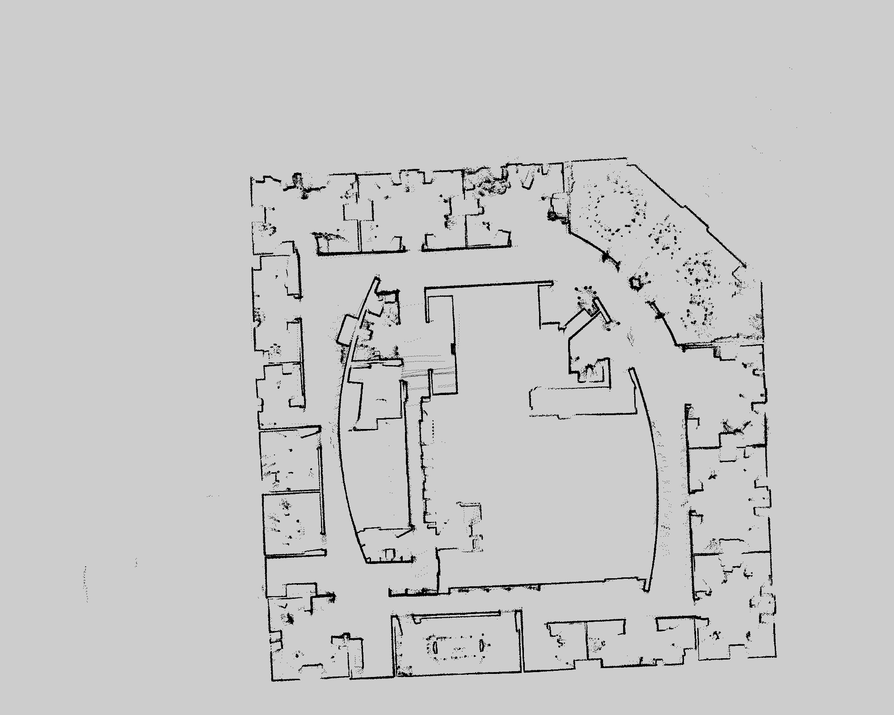
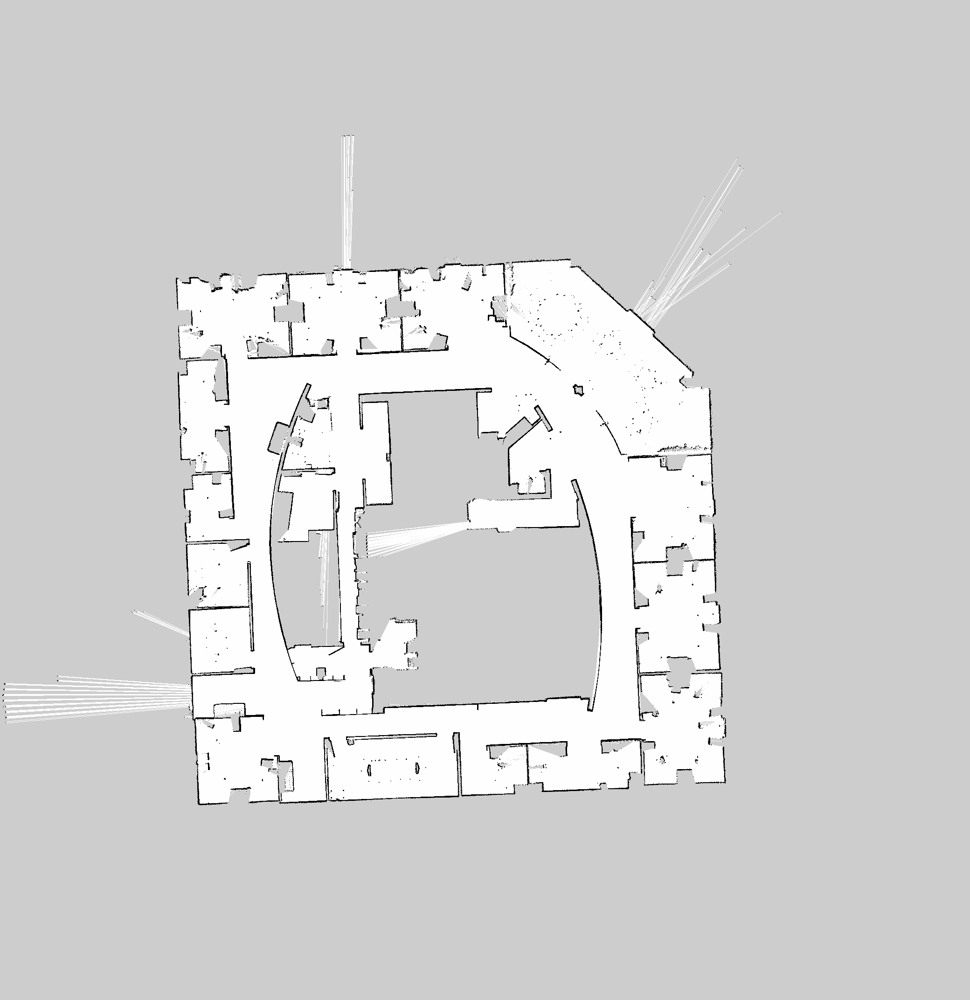
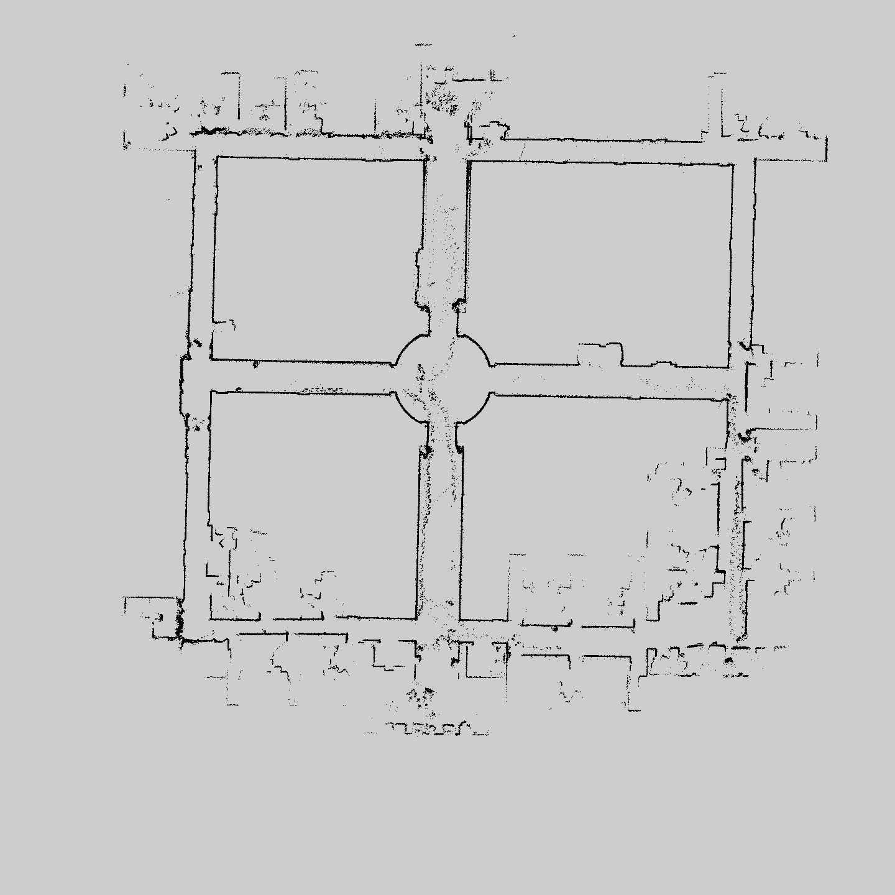
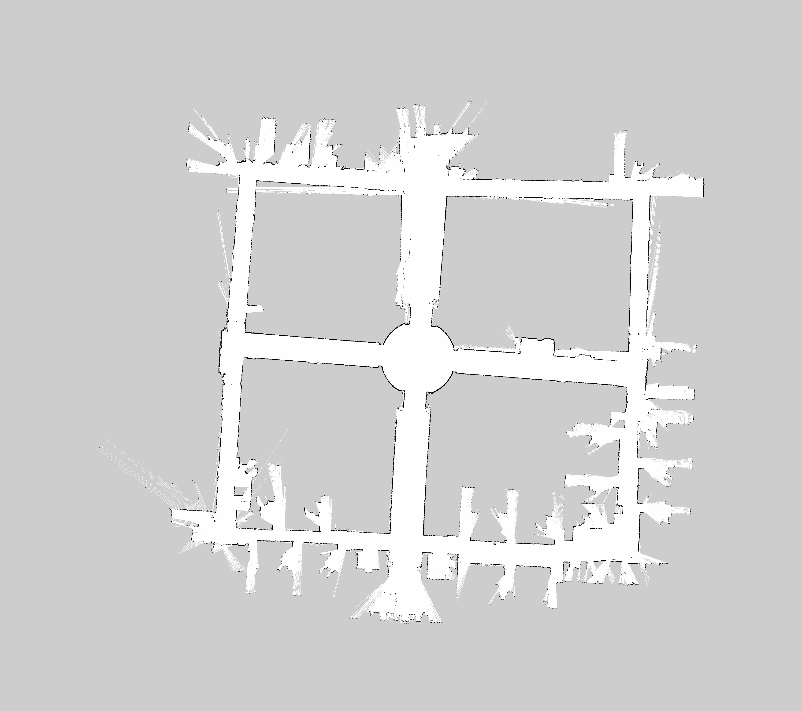
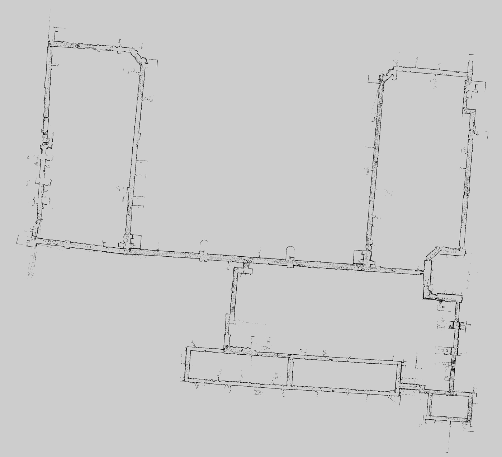
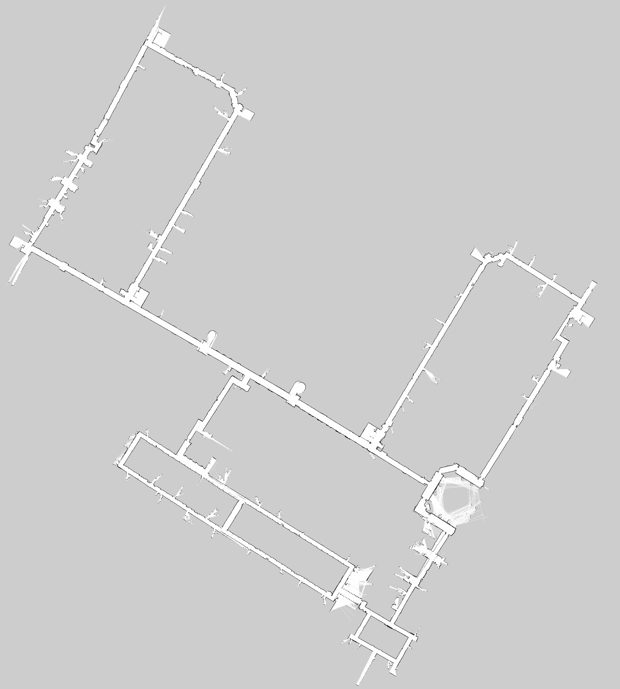

# FastSLAM 2.0 (ROS 2)

A from-scratch C++/ROS 2 implementation of FastSLAM 2.0 (a Rao-Blackwellized particle
filter for SLAM) following Thrun's *Probabilistic Robotics*. The particle filter, occupancy
grid, scan matcher, and motion model are written directly (no `gmapping` / `slam_toolbox` for
the core filter). Tested in NVIDIA Isaac Sim and on the CARMEN benchmark datasets.

The derivation (RBPF factorization, motion and measurement models) is in
[docs/technical_writeup.md](docs/technical_writeup.md) (kind of scrappy right now I used it to take notes. For details, *Probabilistic Robotics* is an amazing book!).

## Robot platform

A self-built differential-drive robot used for live mapping.

<p align="center">
  
  
</p>

| | |
|---|---|
| Compute | NVIDIA Jetson Orin Nano |
| Lidar | RPLidar A1M8 |
| MCU | STM32F411 — closed-loop motor control over UART |
| Drivers / motors | BTS7960 + MG513 gearmotors with quadrature encoders |

Streamed to Foxglove over a Zenoh (`zenoh-plugin-ros2dds`) bridge for live visualization.

## Real-world maps 
\- Recorded using an old implementation, my battery went up in flames, working on it :) \- 

Built online while driving the robot through real indoor spaces. Qualitative for now — no ground truth was captured, so there are no error metrics yet.

All environments visualized in real time with Apartment Hallway and DRDC Office visualized through Foxglove on a Macbook Pro M1 getting the map topic from the Jetson on the robot through the Zenoh bridge. The apartment unit was visualized on RViz2 using ROS2 built in FastDDS through home WiFi. 

| Apartment Hallway | Apartment Unit | DRDC Office Hallway
|---|---|---|
|  |  |  

## Benchmark (vs GMapping)

Both algorithms run through the same deterministic offline pipeline
(`tools/run_benchmark.py`): identical scans and odometry, fed sequentially all with `seed 42`. Scores are the relation metric of Kümmerle et al. 2009 against the
Freiburg relation files, computed by `tools/evaluate_slam.py`. The
problem-level parameters are matched per dataset where applicable: particle count, map resolution, update gates, resampling thresholds, full usable range, every beam. Algorithm-specific noise and likelihood parameters are each algorithm's own
(`configs/{fastslam,gmapping}/<dataset>.yaml`; snapshots in each run's
`results/` directory).

### Intel (2,984 relations):

| FastSLAM 2.0 | GMapping |
|---|---|
|  |  |


| Trajectory | Trans. mean $\pm$ std (m) | RMSE (m) | Max (m) | Rot. mean (deg) |
|---|---|---|---|---|
| FastSLAM 2.0 | 0.049 $\pm$ 0.057 | 0.075 | 0.33 | 1.00 |
| GMapping | 0.064 $\pm$ 0.064 | 0.090 | 0.43 | 1.07 |
| Raw odometry | 7.32 $\pm$ 14.1 | 15.9 | 69.9 | 40.2 |


### ACES (1,279 relations):
| FastSLAM 2.0 | GMapping |
|---|---|
|  |  |

| Trajectory | Trans. mean $\pm$ std (m) | RMSE (m) | Max (m) | Rot. mean (deg) | 
|---|---|---|---|---|
| FastSLAM 2.0 | 0.073 $\pm$ 0.189 | 0.203 | 1.50 | 0.46 |
| GMapping | 0.087 $\pm$ 0.193 | 0.211 | 1.54 | 0.58 |
| Raw odometry | 0.54 $\pm$ 2.65 | 2.70 | 18.9 | 2.29 |


### MIT Killian (4,677 relations) 


| FastSLAM 2.0 | GMapping |
|---|---|
|  |  |

| Trajectory | Trans. mean $\pm$ std (m) | RMSE (m) | Max (m) | Rot. mean (deg) |
|---|---|---|---|---|
| FastSLAM 2.0 | 0.057 $\pm$ 0.164 | 0.173 | 1.67 | 0.41 |
| GMapping | 0.194 $\pm$ 0.461 | 0.500 | 3.54 | 0.54 |
| Raw odometry | 50.3 $\pm$ 128 | 138 | 555 | 9.20 |


## How it works

Each particle holds a pose hypothesis and its own occupancy map. Per scan, once the robot has
moved past a threshold:

1. Predict motion from odometry
2. Scan match against the particle's map (`matcher:` two-stage correlative,
   single-stage grid, or hill-climbing gradient)
3. Sample around the match to fit a Gaussian proposal, draw a new pose
   (Cholesky) and update the weight — or, in `mode: "peak"`, jump to the match
   optimum and weight by its likelihood
4. Integrate the scan into the particle's map
5. Resample when the effective sample size drops

The 2.0 variant folds the current scan into the proposal, so it needs far fewer
particles than FastSLAM 1.0. Peak mode trades the proposal's sample efficiency
for aggressive hypothesis pruning, which wins on corridor-heavy maps
(MIT Killian).

## Layout

```
datasets/    CARMEN .clf logs + .relations ground truth (not committed)
configs/     one config file per algorithm (fastslam, gmapping, slam_toolbox)
results/     benchmark runs — provenance (metrics/config/run.json) committed; maps/figures/logs regenerable
tools/       run_benchmark.py (reproducible runs), evaluate_slam.py (metrics + figures)
ros2_ws/     ROS 2 packages
docs/        derivations and technical writeup
```

The SLAM engine is plain C++ with no ROS dependency (`fastslam_core` library);
ROS 2 does only plumbing. In `ros2_ws/src/fastslam/`:

| File | Role |
|---|---|
| `src/fastslam2.cpp` | FastSLAM 2.0 engine: proposal, weighting, resampling (OpenMP over particles) |
| `src/occupancy_grid_map.cpp` | Chunked hash-map occupancy grid, dynamic expansion |
| `src/scan_integrator.cpp` | DDA raycasting, log-odds updates |
| `src/scan_matcher.cpp` | Scan matchers (two-stage correlative / fine grid / gradient) + likelihood-field model |
| `src/motion_model.cpp` | Thrun odometry motion model |
| `src/fastslam2_node.cpp` | ROS 2 node: topics, TF, params → engine |
| `src/clf_runner.cpp` | Offline runner: .clf → engine directly, no ROS |

The node subscribes `/scan`, pulls `/odom` at the scan's timestamp, and
publishes `/map` (`OccupancyGrid`), `/particles` (`PoseArray`), and the
`map → odom` TF.

The other `ros2_ws/src/` packages: `clf_publisher` replays CARMEN `.clf` logs as
ROS `/scan` + `/odom`; `slam_gmapping` (vendored OpenSLAM GMapping +
`gmapping_clf_runner`) is the benchmark reference. `mapper` (occupancy mapping
with known poses) and `particle_filter_localizer` (Monte Carlo localization on a
known map) are earlier standalone building blocks — FastSLAM 2.0 fuses the two,
each particle carrying both a pose hypothesis and its own map.

## Build

```bash
cd ros2_ws
colcon build --packages-select fastslam
source install/setup.bash
```

## Run

**Benchmark (offline, deterministic).** Processes every scan sequentially —
results don't depend on machine speed, and a fixed seed reproduces a run
bit-for-bit. From the repo root:

```bash
python3 tools/run_benchmark.py intel fastslam --seed 42
python3 tools/run_benchmark.py intel gmapping --seed 42
```

Each run creates `results/<dataset>_<algo>_<tag>/` containing the config
snapshot, seed and git commit (`run.json`), log, trajectories (TUM), map
(pgm/yaml), and — when ground truth exists — `metrics.json` plus evaluation
figures. Configs live in `configs/<algo>/default.yaml`; add variants as new
files and select with `--config <name>`.

Datasets are not committed (size); download from the Freiburg SLAM benchmark:
http://ais.informatik.uni-freiburg.de/slamevaluation/datasets.php into `datasets/`.

**ROS replay (RViz visualization), from `ros2_ws/`:**

```bash
ros2 launch clf_publisher dataset_slam.launch.py clf_file:=../datasets/intel.clf
```

Add `record_traj:=true` to log the `map → base_footprint` trajectory to
`traj_file` (default `../results/ros_replay/`) for evo comparison; the
`dataset_gmapping.launch.py` reference runner takes the same options.

**Live `/scan` + `/odom`:**

```bash
ros2 launch fastslam fastslam2.launch.py 
```

**Isaac Sim (5.1)** — loads a USD world + RTX-lidar robot and bridges to ROS 2:

```bash
[PATH_TO-ISAACSIM]/python.sh isaacsim/isaacsim_launch.py
```

