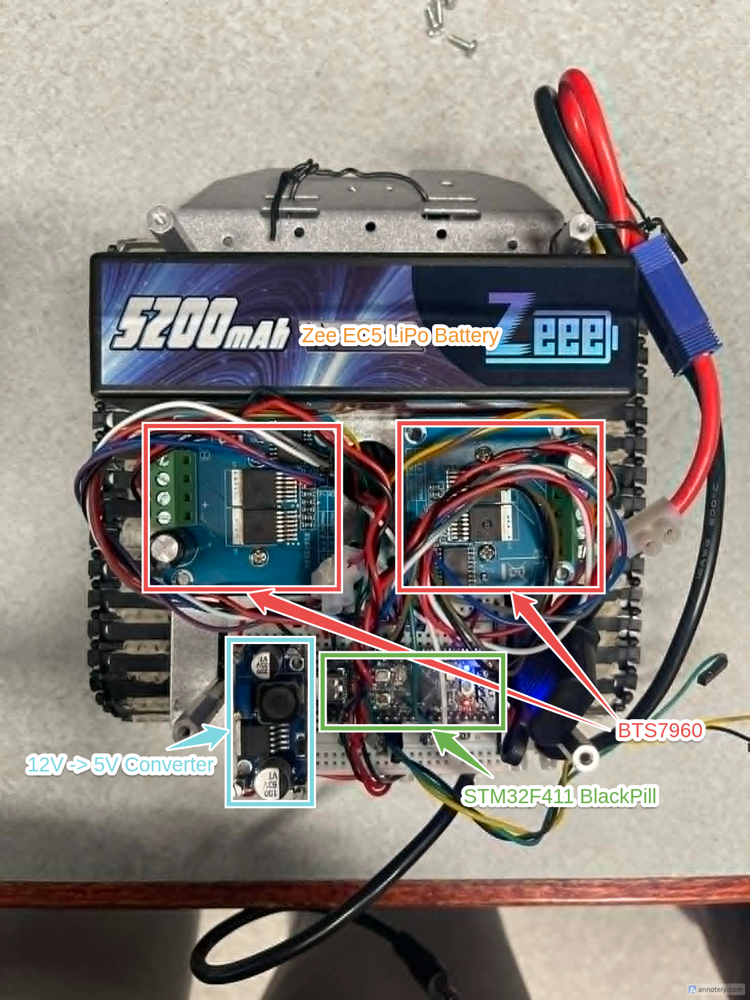
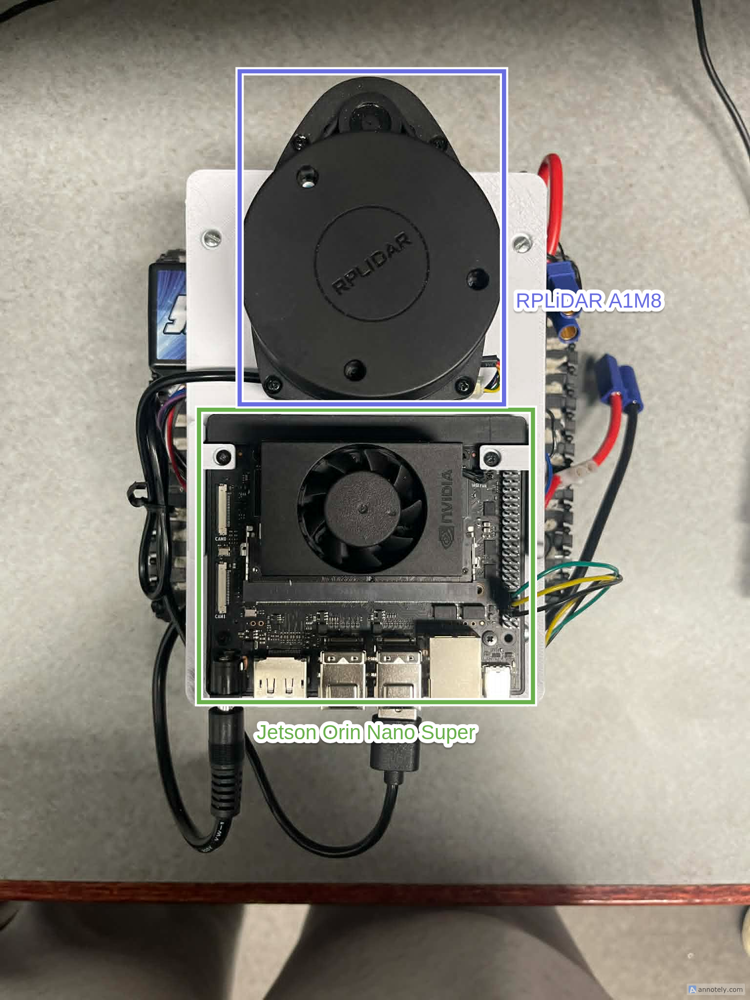
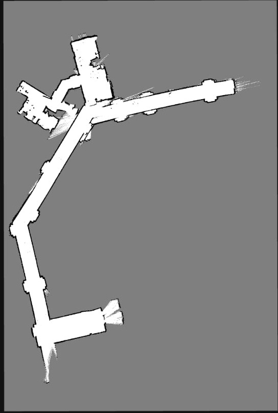
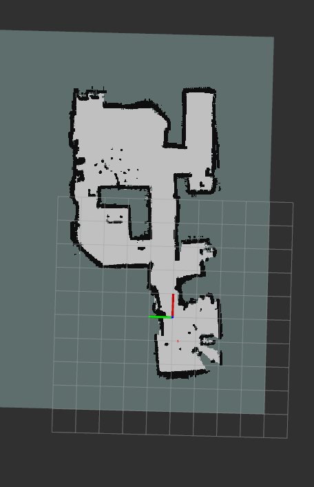
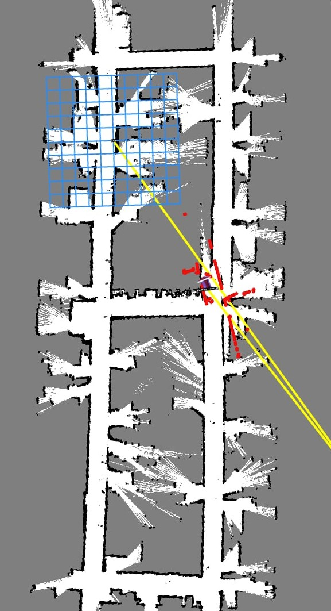
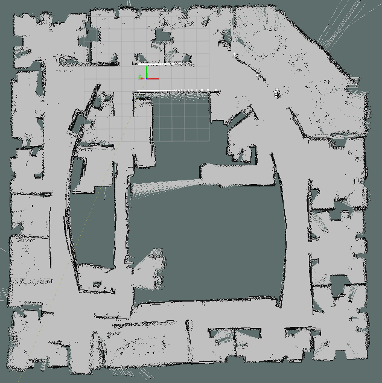
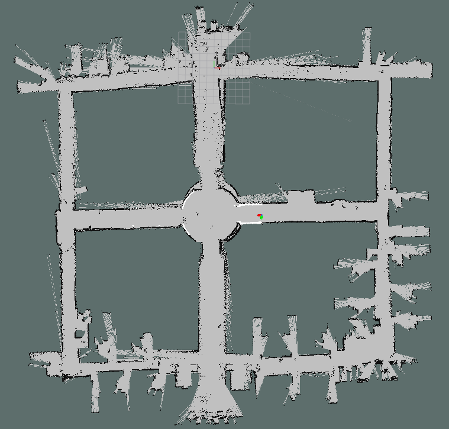

# FastSLAM 2.0 (ROS 2)

A from-scratch C++/ROS 2 implementation of FastSLAM 2.0 — a Rao-Blackwellized particle
filter for SLAM — following Thrun's *Probabilistic Robotics*. The particle filter, occupancy
grid, scan matcher, and motion model are written directly (no `gmapping` / `slam_toolbox` for
the core filter). Tested in NVIDIA Isaac Sim and on the CARMEN benchmark datasets.

The derivation (RBPF factorization, motion and measurement models) is in
[docs/technical_writeup.md](docs/technical_writeup.md).

## Robot platform

A self-built differential-drive robot used for live mapping.

<p align="center">
  
  
</p>

| | |
|---|---|
| Compute | NVIDIA Jetson Orin Nano |
| Lidar | RPLidar A1M8 |
| MCU | STM32F411 — closed-loop motor control over UART |
| Drivers / motors | BTS7960 + MG513 gearmotors with quadrature encoders |

Streamed to Foxglove over a Zenoh (`zenoh-plugin-ros2dds`) bridge for live visualization.

## Real-world maps

Built online while driving the robot through real indoor spaces. Qualitative for now — no ground truth was captured, so there are no error metrics yet.

All environments visualized in real time with Apartment Hallway and DRDC Office visualized through Foxglove on a Macbook Pro M1 getting the map topic from the Jetson on the robot through the Zenoh bridge. The apartment unit was visualized on RViz2 using ROS2 built in FastDDS through home WiFi. 

| Apartment Hallway | Apartment Unit | DRDC Office Hallway
|---|---|---|
|  |  |  

## CARMEN benchmark maps

Offline runs on the standard CARMEN datasets, replayed through `clf_publisher`. Also qualitative
so far; quantitative benchmarking (trajectory and map error vs. ground truth) is planned.

| Intel | ACES |
|---|---|
|  |  |

## How it works

Each particle holds a pose hypothesis and its own occupancy map. Per scan, once the robot has
moved past a threshold:

1. Predict motion from odometry
2. Correlative scan match against the particle's map
3. Sample around the match to fit a Gaussian proposal
4. Draw a new pose (Cholesky), update the particle weight
5. Integrate the scan into the particle's map
6. Resample when the effective sample size drops

The 2.0 variant folds the current scan into the proposal, so it needs far fewer particles than
FastSLAM 1.0.

## Layout

Code is in `ros2_ws/src/fastslam/`:

| File | Role |
|---|---|
| `src/fastslam2_node.cpp` | ROS 2 node: per-scan pipeline, proposal, weighting, resampling (OpenMP over particles) |
| `src/fastslam_node.cpp` | FastSLAM 1.0 (motion-model proposal only) baseline |
| `src/occupancy_grid_map.cpp` | Chunked hash-map occupancy grid, dynamic expansion |
| `src/scan_integrator.cpp` | DDA raycasting, log-odds updates |
| `src/scan_matcher.cpp` | Two-stage correlative matcher + likelihood-field model |
| `src/motion_model.cpp` | Thrun odometry motion model |
| `src/mapper_test_node.cpp` | Mapping-with-known-poses test harness |

Subscribes `/odom`, `/scan`; publishes `/map` (`OccupancyGrid`), `/particles` (`PoseArray`),
and the `map → odom` TF.

## Build

```bash
cd ros2_ws
colcon build --packages-select fastslam
source install/setup.bash
```

## Run

Benchmark dataset (replays a `.clf` log and maps it), from `ros2_ws/`:

```bash
ros2 launch clf_publisher dataset_slam.launch.py clf_file:=datasets/intel.clf
```

Datasets in `ros2_ws/datasets/` have been ignored for commit size, please download your desired datasets from University Freiburg: http://ais.informatik.uni-freiburg.de/slamevaluation/datasets.php

Live `/scan` + `/odom`:

```bash
ros2 launch fastslam fastslam2.launch.py 
```

Isaac Sim (5.1) — loads a USD world + RTX-lidar robot and bridges to ROS 2:

```bash
[PATH_TO-ISAACSIM]/python.sh isaacsim/isaacsim_launch.py
```

Parameters are in `ros2_ws/src/fastslam/config/fastslam_params.yaml`.

## In progress:
- The proposal degenerates in long featureless corridors. The per-beam scan likelihood and the motion model sit on different numerical scales, so the effective sample size collapses and resampling clones one particle in large environments (DRDC Office, ACES, Intel). 
- Map saver
- Refactoring of scan callback