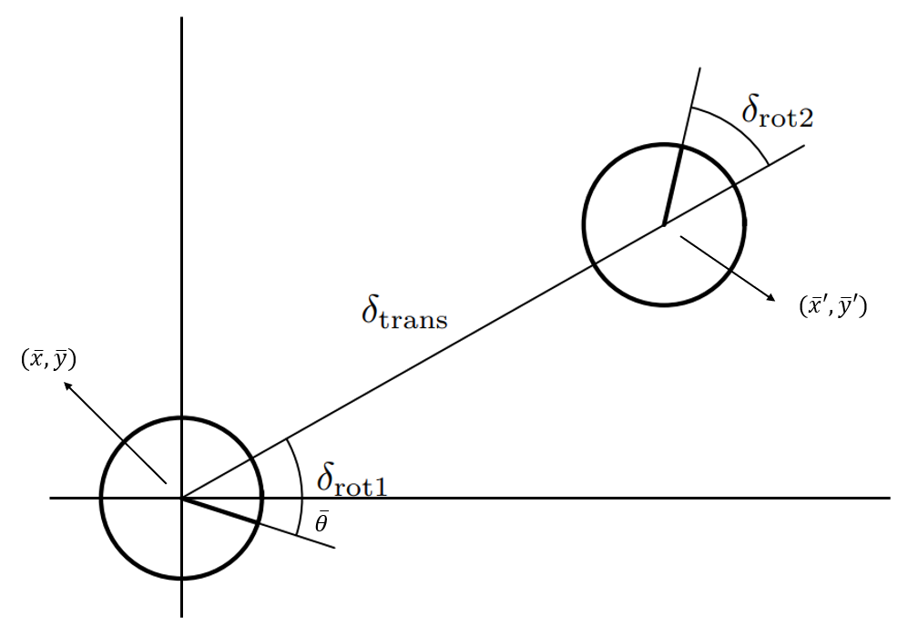

## 2. Defining the problem
### The SLAM problem
Computing the robot's poses and map of the environment at the same time:
- Localization: estimating the robot's location
- Mapping: building a map from sensor data 
- SLAM: building a map and localizing the robot simultaneously

### Formal definition
Given the robot controls: 
    $$u_{1:t} = \{u_1, u_2, u_3, ..., u_t\}$$
and given the measurement observations: 
    $$z_{1:t} = \{z_1, z_2, z_3, ..., z_t\}$$
how can we estimate the map and the path of the robot, namely: 
    $$p(x_{1:t}, m | z_{1:t}, u_{1:t})$$
With: 
- $x_t$: pose of the robot at time $t$, represented by position and heading $\left<x,y,\theta\right>^T$
- $m$: map observed

### Rao-Blackwellized Factorization
The full SLAM posterior $p(x_t, m | z_{1:t}, u_{1:t})$ can be written in the factored form:
$$ p(x_{1:t}, m | z_{1:t}, u_{1:t}) = p(x_{1:t}|z_{1:t}, u_{1:t}) \times\prod_{n=1}^{N}p(m_i|x_{1:t}, z_{1:t})$$

With: 
- $m_i$: single grid cell of the map (for occupancy grid)
- $N$: the occupancy grid size

So, instead of estimating the robot's pose and the entire map all all at once (which doesn't have a closed form analytically), we can split the problem into estimating the pose of the robot at time t given measurement and control, and estimating the map given the estimated state and measurement. 

### Estimating the state posterior $p(x_{1:t}|z_{1:t}, u_{1:t})$ - a.k.a the "Proposal Distribution"
Using Bayes' Rule:
$$
p(x_{1:t}|z_{1:t}, u_{1:t}) = \frac{p(z_{1:t}|x_{1:t})p(x_{1:t}|u_{1:t})}{p(z_{1:t}|u_{1:t})}
$$
then apply the Law of Total Probability: 
$$ 
 = \frac{p(z_{1:t}|x_{1:t})p(x_{1:t}|u_{1:t})}{\int p(z_{1:t}|x_{1:t})p(x_{1:t}|u_{1:t})dx_{1:t}} 
$$

To calculate the normalization term $\tau$ (the denominator) with a 3 dimensional state vector $x_t = <x_t, y_t, \theta _t>$, the term computationally impossible to estimate. 

Since the integral is **intractable**, we approximate the distribution using a particle filter (or sequential Monte Carlo method). Instead of representing the full continuous distribution over poses, we maintain a set of weighted samples (particles), each representing a hypothesis about the robot's trajectory. Each particle carries its own pose and its own map. The particle filter approximates the posterior by concentrating particles in high-probability regions through importance weighting and resmpaling. 

So we define a set of $K$ particles to represent $p(x_{1:t}|z_{1:t},u_{1:t})$ discretely: 
$$S_t = \{ x_{1:t}^{(k)}, w_t^{(k)} \}_{k=1}^{K}$$
where for every particle $k$ from $1$ to $K$:
- $x_{1:t}^{(k)}$ is the specific trajectory of the particle 
- $w_{t}^{(k)}$ is the importance weight of the particle

When put together, the state posterior probability distribution is approximated by a discrete probability distribution tracked using a particle filter: 

$$p(x_{1:t} \mid z_{1:t}, u_{1:t}) \approx \sum_{k=1}^{K} w_t^{(k)} \delta \left( x_{1:t} - x_{1:t}^{(k)} \right)$$
where: 
- $\delta \left( x_{1:t} - x_{1:t}^{(k)} \right)$ is the Dirac delta function. It represent the point mass distribution at $x_{1:t}$. This can be intuitively understand as each particle representing a hypothesis about the system's state. So because each particle is considered certain about its own trajectory, the mapping problem for each particle simplifies to just mapping with known poses.

(Note: the $\sum$ here is summing up $\delta$ functions. It can be think of as a mathematical way to express a table-like reprentation of possible values and their probabilities in discrete distributions. )

### Estimating Map $p(m|x_{1:t}, z_{1:t})$

Within a particle's map: 
Let $m_i$ denote the grid cell with index i. Each $m_i$ will have a binary occupancy value which specifies whether a cell is occupied or free. The issue is evaluating $p(m|z_{1:t},  x_{1:t})$ is the dimensionality. It is a discrete probability distribution for an occupancy grid but the total number of possible maps would be $2^N$ with $N$ being number of cells in map. 

Therefore, even though it might not be mathematically or physically correct, we assume independence between the the cells $m_i$, and factorize: 
$$p(m|x_{1:t}, z_{1:t}) = \prod_{i}p(m_i|x_{1:t}, z_{1:t})$$

This leaves us with the one missing variable $x_{1:t}$. Luckily, we've represent the pose distribution using Monte Carlo estimation. Therefore each particle can integrate its own map with that's locally consistent which simplifies to mapping with the particle's pose. 
 

### Putting everything together 
The full SLAM posterior $p(x_t, m | z_{1:t}, u_{1:t})$ with state estimation using particle filter for non-linear motion, multi-hypothesis tracking would then  be: 

$$p(x_{1:t}, m \mid z_{1:t}, u_{1:t}) \approx \sum_{k=1}^{K} w_t^{(k)} \delta \left( x_{1:t} - x_{1:t}^{(k)} \right) \prod_{i=1}^{N} p(m_i \mid x_{1:t}^{(k)}, z_{1:t})$$

There is a subtle problem, which is estimating the entire state history $x_{1:t}$. There are two main forms of SLAM problems: 
- Full SLAM: estimating the posterior over the entire path $x_{1:t}$
- Online SLAM: estimating the posterior over the momentary pose along with the map  

FastSLAM is an online SLAM algorithm which exploits the Markov assumption: the state $x_t$ is conditionally independent from $x_{1:t-1}$ given $x_{t-1}$. The problem then concretetly is defined as:  
$$p(x_{t}, m \mid z_{1:t}, u_{1:t}) \approx \sum_{k=1}^{K} w_t^{(k)} \delta \left( x_{t} - x_{t}^{(k)} \right) \prod_{i=1}^{N} p(m_i \mid x_{1:t}^{(k)}, z_{1:t})$$

As the reader may notice, we don't condition on $x_{t-1}$ even though its stated in the Markov property. This is because each particle at each iteration encapsulate the state $x_{t-1}$ and is represented as $\delta \left( x_{t} - x_{t}^{(k)} \right)$ .

So our implementation is clear, keep track of the state posterior using particles as an approximation, and for each particle, integrate the measurement $z_t$ into the cells $m_i$.

## 3. The Algorithms
The FastSLAM algorithm operates as a recursive filter. At each timestep, the robot receives odometry and a lidar scan. The algorithm updates each particle's pose based on the odometry message, evaluate the scan, and updates the map. FastSLAM1.0 and 2.0 differ mainly in how the proposed distribution (set of particles' poses) is determined.

### Motion Model (`motion_model.cpp`)
This is used to predict the new pose of each particle based on odometry. Each particle new pose is determined using the odometry-based motion model from Thrun (2005). The motion model is decomposed into three components: 

1. The initial rotation $\delta _{rot1}$
2. The translation $\delta _{trans}$
3. The final rotation $\delta _{rot2}$

Gaussian noise are then scaled by the parameters $a_1$ through $a_4$. With (rough intuition for tuning): 
- $a_1$: rotation noise from rotation. This is the dominant rotational error term. Tune high if your robot has high in place rotation error. 
- $a_2$: rotation noise from translation. This is the heading drift from straight line driving. Tune high if your robot struggle to move in a straight line.
- $a_3$: translation noise from translation. This is just the pure distance error. Tune high if your robot doesn't track linear motion well. 
- $a_4$: translation noise from rotation. This is the translation error from rotation. Tune high if your robot translate unexpectedly from in-place rotation.

These injected uncertainty give each particle a slightly different pose to diversify the particles' poses, expand the search window, and represent uncertainty in odometry.

### Likelihood field measurement model (`scan_matcher.cpp`)
Given a candiate pose and a map, the measurement model answers the question: "How well does the current scan match the map from the candidate pose?"

For each lidar beam, we project the endpoint into the map using the candidate pose. We're assuming each beam is independent, so the likelihood $p(z_t|x_t, m)$ can be calculated as:

$$ p(z_t|x_t,m) = \prod_{k}p(z_t^{k} | x_t, m)$$
for each individual beam $z_t^{k}$, 
$$p(z_t^{k}|x_t,m) = z_{hit} \cdot p_{hit} + z_{rand} \cdot p_{rand} $$

Where the parameters should be determined by the sensor's intrinsics: 
- $p_{hit}$: measurement probability. Calculated by evaluating $N(0, \sigma _{hit})$ at $dist$ where $dist$ is the euclidean distance from the beam's endpoint to the nearest occupied cell.
- $z_{hit}$: the weight of the correct measurement (how likely the sensor reports a correct measurement return)
- $p_{rand}$: the probability that the measurement is a noisy measurement, calculated as $\frac{1}{z_{max}}$ if $0\le z_t^{k} \le z_{max}$ with $z_{max}$ being the maximum range of the sensor. So, its a uniform distribution from $[0,z_{max}]$ to account for the uncertainty of picking up a random measurement in the sensor.
- $z_{rand}$: the weight of the random measurement (how likely the sensor reports a unexplainable, random return)

In the implementation, the normalization division in calculating $p_{hit}$ is skipped because only the relative weight between particles matter. Out of range measurements are diregarded.

The total log-likelihood for the scan is the sum across all beam to achieve numerical stability: 
$$\log (p(z_t | x_t, m)) = \sum_{k} \log(p(z_t^{k}|x_t,m)) $$

### FastSLAM 1.0 (brief)
In FastSLAM 1.0, the proposal distribution $p(x_t | u_t, z_t)$ is just the motion model: 
$$ p(x_t | x_{t-1}, u_t) $$

Each particle pose samples from this distribution, then the measurement likelihood is used to compute the importance weight (how well the measurement fits the sampled pose).

Particles with high likelihood survive resampling, particles with low likelihood are eliminated.

The problem: most particles land in regions of low likelihood because the motion model doesn't know about the scan. Particles are wasted exploring poses that the scan could immediately rule out. This requires many particles to work reliably.

### FastSLAM 2.0

FastSLAM 1.0 samples each particle's pose from the motion model alone and only afterwards corrects it with the measurement (through the importance weight). FastSLAM 2.0 folds the current measurement $z_t$ *into* the proposal, so particles are drawn near poses that agree with both odometry and the scan. Far fewer particles are wasted on poses the scan would immediately rule out.

**Overview.** For each particle:
1. Predict the new pose from odometry (motion model)
2. Scan match to find the best pose (the mode of the proposal)
3. Sample around that mode to fit a Gaussian approximation of the proposal
4. Draw the new pose from the Gaussian using Cholesky decomposition
5. Update the particle's importance weight
6. Compute the map-to-odom transform from the best particle
7. Resample when the effective sample size drops

The rest of this section works through each step. The per-particle loop is independent, so it is parallelized across particles (OpenMP).

#### The improved proposal distribution
Instead of sampling from the motion model, FastSLAM 2.0 samples from the pose posterior conditioned on the latest scan:
$$
p(x_t \mid x_{t-1}^{(k)}, z_t, u_t, m_{t-1}^{(k)}) = \frac{p(z_t \mid x_t, m_{t-1}^{(k)})\, p(x_t \mid x_{t-1}^{(k)}, u_t)}{\int p(z_t \mid x', m_{t-1}^{(k)})\, p(x' \mid x_{t-1}^{(k)}, u_t)\, dx'}
$$

The numerator is the product of two terms we already have: the measurement likelihood (the likelihood field model above) and the motion model (above). The denominator is a normalizer with no closed form. Following Montemerlo (2003), we approximate the numerator as a Gaussian around its mode and sample from that Gaussian.

#### 1. Motion prediction
Apply the motion model deterministically (no noise) to move the particle from $x_{t-1}^{(k)}$ to an odometry-predicted pose $\bar{x}_t^{(k)}$. This is the center of the motion model term and the starting point for the scan match.

#### 2. Finding the mode (scan matching)
Run the correlative scan matcher (the likelihood field model above) starting from $\bar{x}_t^{(k)}$ to find the pose $x^*$ that maximizes the measurement likelihood $p(z_t \mid x, m^{(k)})$ over a search window. Because the measurement term is far sharper than the motion term, $x^*$ is essentially the mode of the proposal numerator.

#### 3. Gaussian approximation of the proposal
Evaluate the numerator on a small grid of poses $\{x_j\}$ around $x^*$. At each $x_j$, compute the log numerator:
$$
\log \tilde{w}_j = \underbrace{\log p(z_t \mid x_j, m^{(k)})}_{\text{measurement (likelihood field)}} \; + \; \underbrace{\log p(x_j \mid x_{t-1}^{(k)}, u_t)}_{\text{motion model}}
$$

Treating the normalized values $w_j = \tilde{w}_j / \sum_l \tilde{w}_l$ as a discrete distribution over the grid, the proposal mean and covariance are the weighted moments:
$$
\mu^{(k)} = \sum_j w_j\, x_j, \qquad \Sigma^{(k)} = \sum_j w_j\, (x_j - \mu^{(k)})(x_j - \mu^{(k)})^\top
$$

The heading component of $\mu^{(k)}$ is a circular mean ($\operatorname{atan2}$ of the weighted $\sin$/$\cos$), and heading differences are wrapped to $[-\pi, \pi)$. To stay numerically stable, the weights are computed with the log-sum-exp trick — subtract $l_{\max} = \max_j \log \tilde{w}_j$ before exponentiating — and a small $\epsilon$ is added to the diagonal of $\Sigma^{(k)}$ to keep it positive definite.

#### 4. Sampling the new pose
Draw the new pose from $\mathcal{N}(\mu^{(k)}, \Sigma^{(k)})$ using the Cholesky factorization $\Sigma^{(k)} = L L^\top$, where $L$ is lower-triangular (computed in closed form for the $3\times3$ case):
$$
x_t^{(k)} = \mu^{(k)} + L\,\mathbf{z}, \qquad \mathbf{z} \sim \mathcal{N}(0, I_3)
$$

This produces a sample with the correct mean and covariance from three independent standard normals.

#### 5. Importance weight
Since each particle samples from its *own* proposal, the importance weight must correct for that proposal's normalizer. In FastSLAM 2.0 the per-step weight factor is exactly the intractable integral from the proposal — which we already approximated by the grid sum:
$$
\eta^{(k)} = \int p(z_t \mid x', m_{t-1}^{(k)})\, p(x' \mid x_{t-1}^{(k)}, u_t)\, dx' \;\approx\; \sum_j \tilde{w}_j
$$

The weight updates multiplicatively (additively in log space):
$$
w_t^{(k)} = w_{t-1}^{(k)} \cdot \eta^{(k)} \quad\Longleftrightarrow\quad \log w_t^{(k)} \mathrel{+}= \log\!\Big(\sum_j e^{\log \tilde{w}_j - l_{\max}}\Big) + l_{\max}
$$

Intuitively, $\eta^{(k)}$ measures how much total probability mass the particle's proposal region carries: particles whose predicted motion and observed scan agree well accumulate higher weight.

#### 6. Map update
Integrate the scan into the particle's own map at the newly sampled pose $x_t^{(k)}$ — DDA raycasting with log-odds updates, i.e. mapping-with-known-poses for that particle.

#### 7. Resampling
Resampling concentrates particles in high-probability regions, but doing it every step destroys diversity (good hypotheses get discarded by chance). We resample only when the effective sample size falls below a fraction of the particle count:
$$
N_\text{eff} = \frac{1}{\sum_k \big(\bar{w}_t^{(k)}\big)^2}, \qquad \text{resample if } N_\text{eff} < \tau \cdot K
$$

where $\bar{w}_t^{(k)}$ are the weights normalized to sum to 1 and $\tau$ is the resample threshold. When triggered, particles are drawn with probability proportional to their weight and the weights are reset.

#### Map-to-odom transform (ROS integration)
The map is published in the `map` frame while wheel odometry lives in the `odom` frame. The highest-weight particle is taken as the current best estimate, and its corrected pose defines the `map → odom` transform broadcast on TF — so the rest of the navigation stack sees a drift-corrected pose without ever touching the raw odometry.

